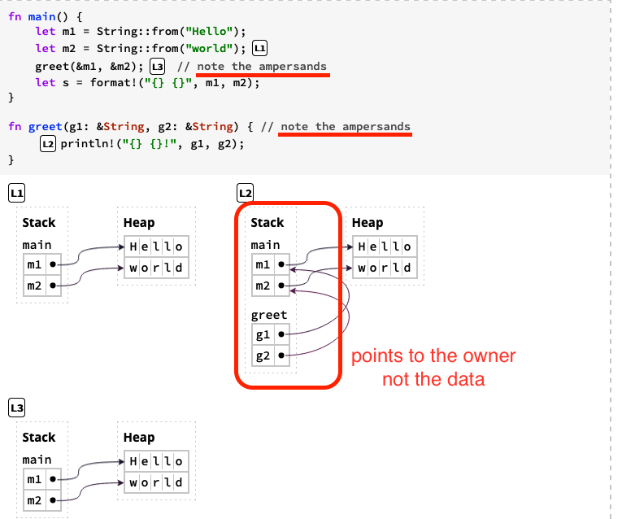
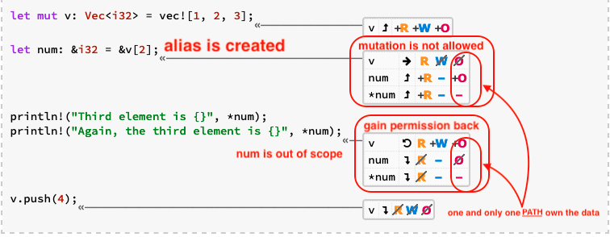
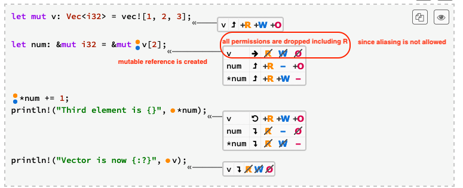

# Ownership

> 💡 a set of rules that govern how a Rust program manages memory (heap) -> make memory safety guarantee without garbage
> collector

## Ownership Rules

- Each data in ***heap*** has an owner.
- There can only be one owner at a time.
- When the owner goes out of scope, the value will either be dropped or returned

#### Move

- Ownership can be transferred by moves, which happen on **_assignments_** and **_function calls_**.

> Moved heap data principle: if a variable x moves ownership of heap data to another variable y, then x cannot be used
> after the move.

```rust
fn main() {
    let s1 = gives_ownership();         // gives_ownership moves its return
    // value into s1

    let s2 = String::from("hello");     // s2 comes into scope

    let s3 = takes_and_gives_back(s2);  // s2 is moved into
    // takes_and_gives_back, which also
    // moves its return value into s3
} // Here, s3 goes out of scope and is dropped. s2 was moved, so nothing
// happens. s1 goes out of scope and is dropped.

fn gives_ownership() -> String {             // gives_ownership will move its
    // return value into the function
    // that calls it

    let some_string = String::from("yours"); // some_string comes into scope

    some_string                              // some_string is returned and
    // moves out to the calling
    // function
}

// This function takes a String and returns one
fn takes_and_gives_back(a_string: String) -> String { // a_string comes into
    // scope

    a_string  // a_string is returned and moves out to the calling function
}
```

---

## Reference

> References are non-owning pointers, because they do not own the data they point to



### Implicit dereferencing of Rust

```rust
fn main() {
    let x: Box<i32> = Box::new(-1);
    let x_abs1 = i32::abs(*x); // explicit dereference
    let x_abs2 = x.abs();      // implicit dereference
    assert_eq!(x_abs1, x_abs2);

    let r: &Box<i32> = &x;
    let r_abs1 = i32::abs(**r); // explicit dereference (twice)
    let r_abs2 = r.abs();       // implicit dereference (twice)
    assert_eq!(r_abs1, r_abs2);

    let s = String::from("Hello");
    let s_len1 = str::len(&s); // explicit reference
    let s_len2 = s.len();      // implicit reference
    assert_eq!(s_len1, s_len2);
}
```

- works for multiple layers of pointers

## Path

> anything you can put on the left side of an assignment operator

- eg: a, *a, a[0], a.field

## Permission

> permissions are defined paths, describe how the compiler "thinks" about your program before the program is executed.

- Read (R): data **_can be copied_** to another location.
- Write (W): data **_can be mutated in-place_**.
- Own (O): data can be **_moved or dropped_**.

```rust
fn main() {
    // by default path has RO permission
    let a = 5;

    // add W permission by mut
    let mut b = 5;

    let mut v: Vec<i32> = vec![1, 2, 3];
                                            // <-   v: RWO
    let num: &i32 = &v[2];
                                            // <- num: R O 
}
```

> reference can **_temporarily remove_** permission on path, since some permission are **_mutually exclusive_** (data
> should not be aliased and mutated)

> borrow checker make use of permission to check if your programme is safe

> Permissions Are Returned At The End of a Reference's Lifetime

[//]: # (todo: F permission)

## Simultaneous Aliasing and Mutation

> Data can be aliased. Data can be mutated. But data cannot be both aliased and mutated.

### Problems of Simultaneous Aliasing and Mutation

> Aliasing and mutation at the same time is error-prone

- data race in concurrent programming
- deallocating at one variable and leaving others pointing to deallocated memory is dangerous
- mutating at one variable break promise expected by other variable

> ∴ Rust disallow **_simultaneous_** Aliasing and Mutation

### Immutable references (shared references)



### Mutable references (unique references)



### Trick to downgrade W permission temporarily

```rust
fn main() {
    let mut v: Vec<i32> = vec![1, 2, 3];
    let num: &mut i32 = &mut v[2];
    let num2: &i32 = &*num;
                                     // alias is created
                                     // <-   *num: R
                                     // <-  *num2: R
                                     // <-    num: R
                                     // <-   num2: R O
    
    println!("{} {}", *num, *num2);
}
```