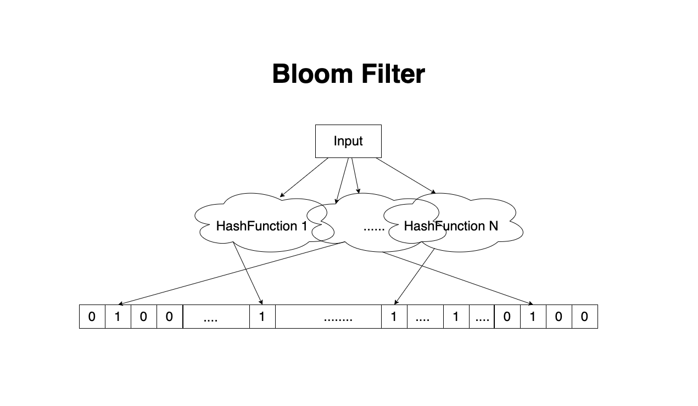

# Bloom Filter

## What is Bloom Filter
- A ***space-efficient*** data structure that quickly checks if an item is ***likely in*** a set or ***definitely not in it***. 
- Multiple hash functions and a bit array are used to store and check for the presence of items

## Advantage
- O(1) time complexity for both querying and insertion operations

## Bear it mind
- collision may happend, apply to fault tolerance scenario only
- removal of elements is not possible without rebuilding entire bit array as it represents the aggregation of all data

## Typical use Case
- **Pre-checking before heavy operations**
  - In many DBMS, bloom filter is used to check if the value exists before doing actual io operation, eg: before LSM tree searching
- **Space-saving and performance improvement**
  - eg: Storing a large amount of blacklisted email address require a lot of disk space, converting the list to a bloom filter can easily be designed to strike a balance between **space**, **performance** and **correctness**

## Collsion rate
\\[
\begin{aligned}
P\simeq (1-e^{-kn/m})^k \\\\
\\\\
&\textit{ P = probability of false positive} \\\\
&\textit{ m = size of the bit array} \\\\
&\textit{ n = total element} \\\\
&\textit{ k = number of hash function} \\\\
\end{aligned}
\\]

## Tool
[Bloom Filter Calculator](https://hur.st/bloomfilter/ )

## Ref
[Bloom Filter](https://www.jasondavies.com/bloomfilter/)